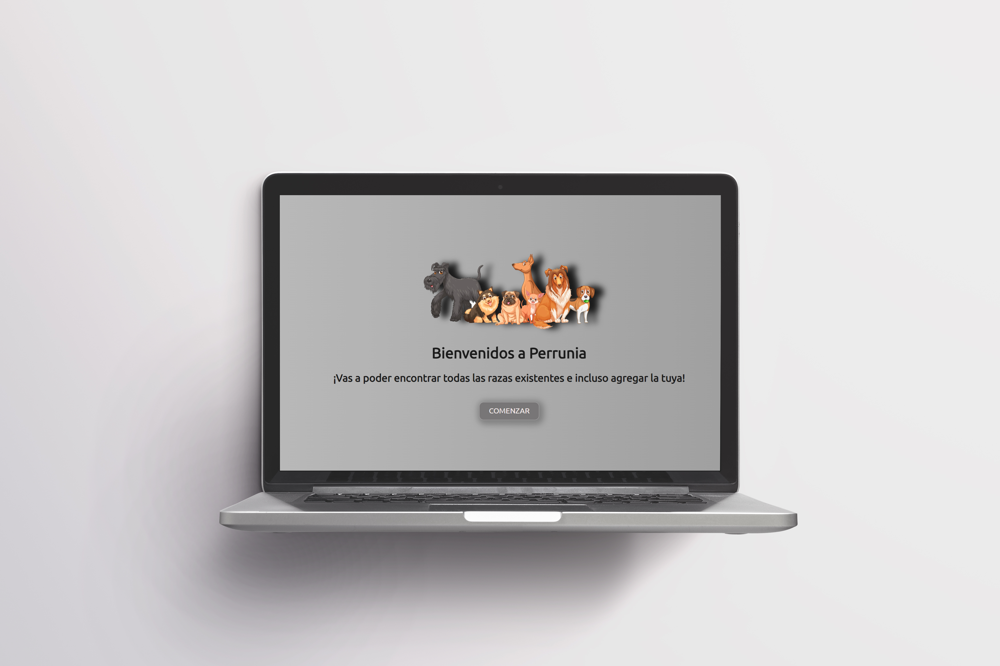
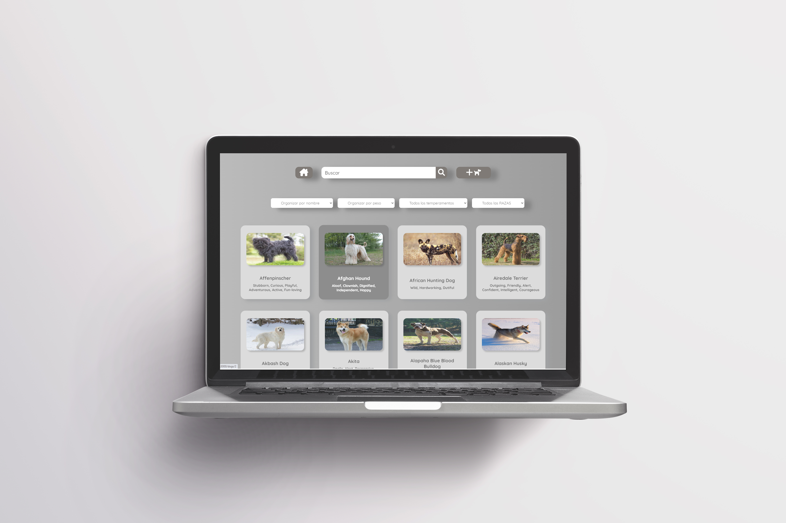
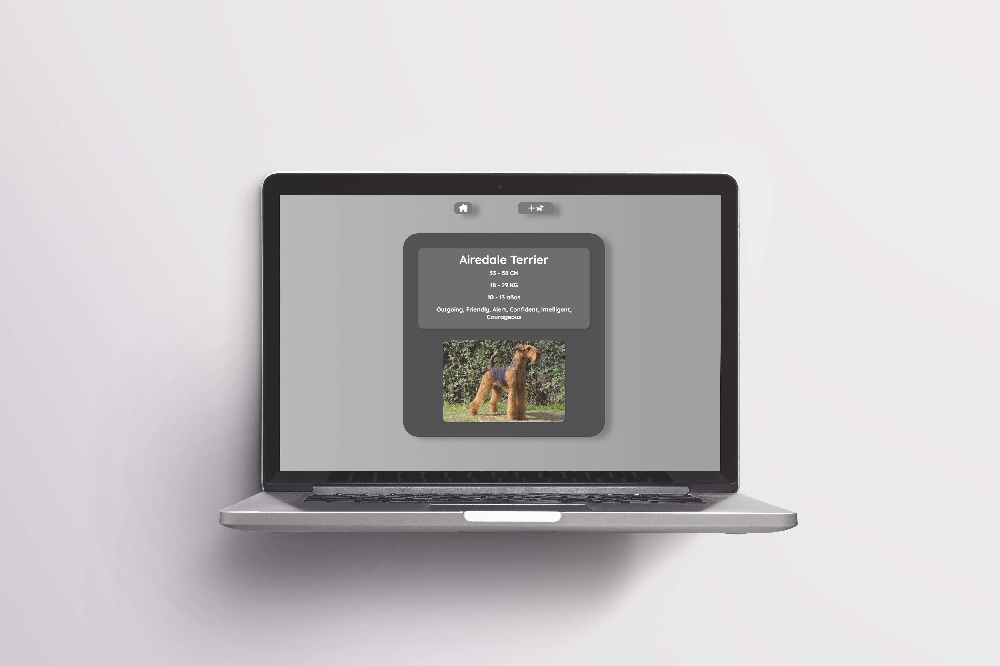
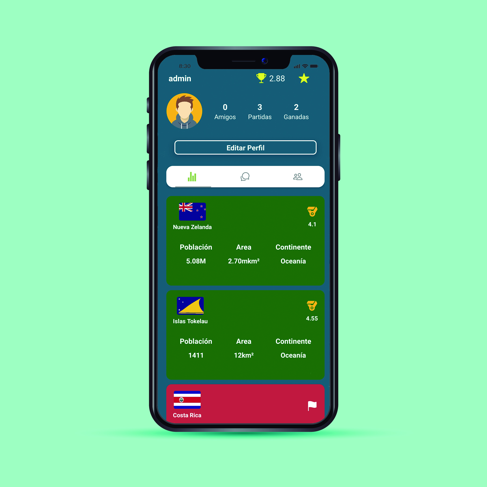

<h1 align="center">Hola 👋, Soy Matías Mazzia</h1>
<h3 align="center">Apasionado Full Stack Developer de Argentina</h3>

Super agradecido de que estes en mi espacio de trabajo personal, contarte que de muy chico soy apasionado del mundo IT, siempre tratando de superar mis propias expectativas, con educación y trabajo en equipo puedo decir que las estoy cumpliendo.

<h3 align="left">Stack:</h3>

🚀 JavaScript                                                                                                                                              
🚀 ReactJS                                                                                                     
🚀 React Native                                                                                                                
🚀 Redux                                                                                                         
🚀 Node.js                                                                                             
🚀 Express                                                                                                                   
🚀 Sequelize / PostgreSQL                                                                                                                              
🚀 HTML                                                                                      
🚀 CSS                                                                                                                                   
🚀 TailwindCSS                                                                                                                   
🚀 Git & Github                                                                                                      
🚀 Scrum 

<h4 align="left">Contactame::</h4>

&nbsp;

<h4 align="left">🔨PROYECTOS:</h4>

## Dogs app

  

  

  

  

## Worldgame app
<h4 align="center">mobile:</h4>

  
  

  

  

