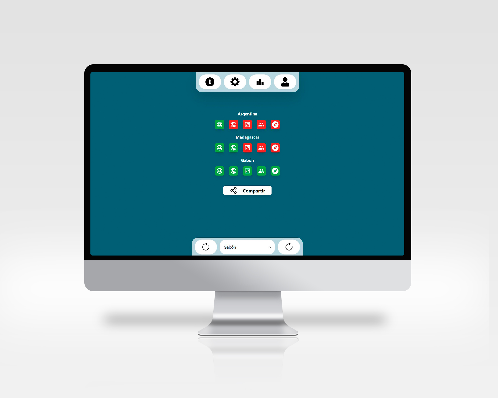
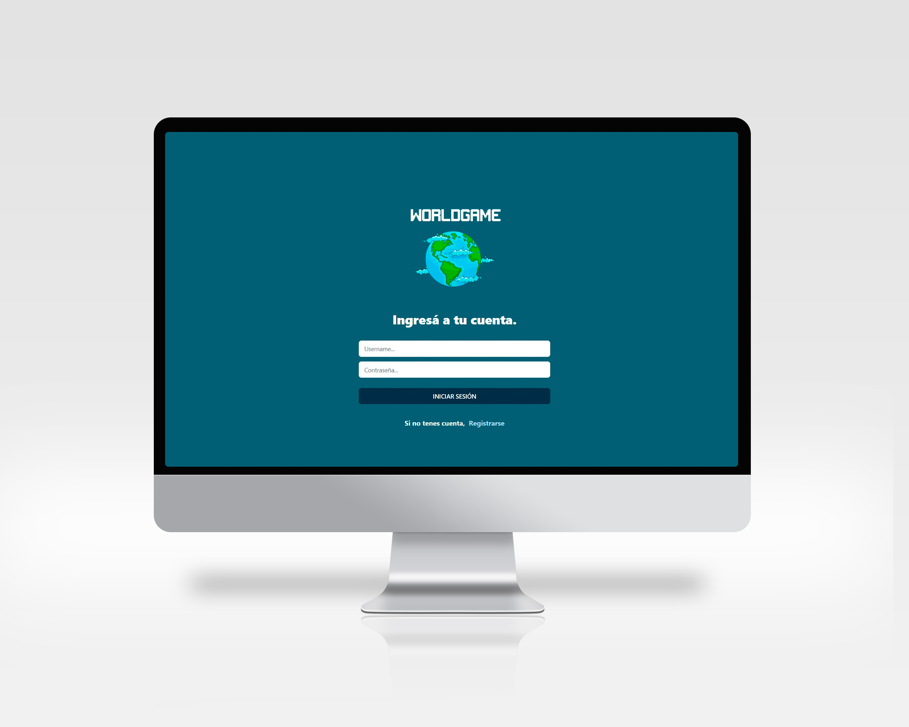
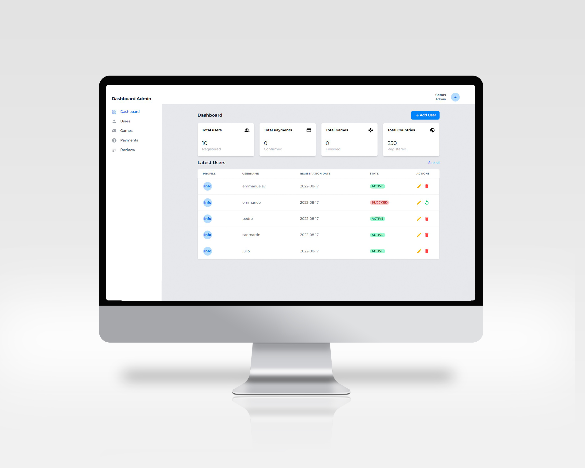
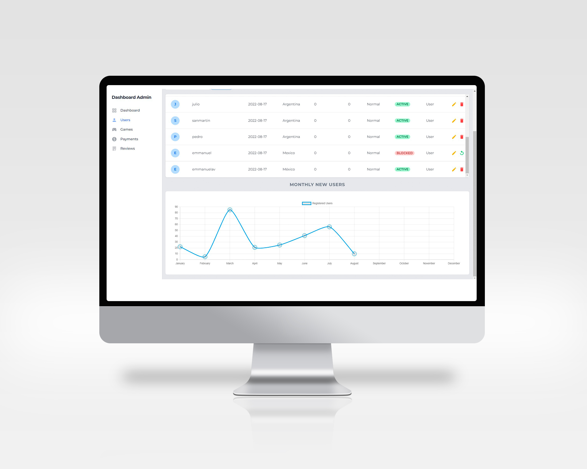

<h1 align="center">Hola 👋, Soy Matías Mazzia</h1>
<h3 align="center">Apasionado Full Stack Developer de Argentina</h3>

Super agradecido de que estes en mi espacio de trabajo personal, contarte que de muy chico soy apasionado del mundo IT, siempre tratando de superar mis propias expectativas, con educación y trabajo en equipo puedo decir que las estoy cumpliendo.

<h3 align="left">Stack:</h3>

🚀 JavaScript                                                                                                                                              
🚀 ReactJS                                                                                                     
🚀 React Native                                                                                                                
🚀 Redux                                                                                                         
🚀 Node.js                                                                                             
🚀 Express                                                                                                                   
🚀 Sequelize / PostgreSQL                                                                                                                              
🚀 HTML                                                                                      
🚀 CSS                                                                                                                                   
🚀 TailwindCSS                                                                                                                   
🚀 Git & Github                                                                                                      
🚀 Scrum 

<h4 align="left">Contactame::</h4>

&nbsp;

<h4 align="left">🔨PROYECTOS:</h4>

## Dogs app🐕‍🦺
#### Repositorio:[matimazzia/Dogs-App](https://github.com/matimazzia/PI-Dogs-main) encontraras información detallada

Proyecto Individual del Bootcamp Henry 
Me desempeñe como Full-Stack Developer

Diseñe y desarrolle una pagina web sobre perros que incluye:
🐕‍🦺 Búsqueda por nombre
🐕‍🦺Filtrado y ordenamiento
🐕‍🦺 Opción para agregar un perro

Se utilizo: 
✔ Javascript
✔ ReactJS
✔ Redux
✔ CSS puro
✔ NodeJS
✔ Express
✔ PostgreSQL
✔ Sequelize

  

  

  

  

## Worldgame app🌎
#### Repositorio:[Feli-dev/PF-WorldGame](https://github.com/Feli-dev/PF-WorldGame),[matimazzia/worldgame-web](https://github.com/matimazzia/PF-WorldGame) encontraras información detallada

📌 Un juego de móvil desarrollado para hacer la geografía más divertida

Proyecto grupal final del Bootcamp Henry. 
Me desempeñé como Front-End & Mobile Developer. 

El proyecto cuenta con una versión mobile, una versión web y un panel de administrador.

Tecnologías:
🎮 Database: PostgreSQL
🎮 Back-End: NodeJs, Express, Sequelize
🎮 Front-End: React JS, React Native, Redux, Tailwind, Material-UI, HTML
🎮 Librearías Adicionales: 
✔ Socket-IO (Chat integrado)
✔ Chart.js (Gráficas en tiempo real)
✔ Stripe (Pasarela de pagos)
✔ Cloudinary (Subir foto de perfil)
✔ Nodemailer (Envío de mails)

<h4 align="center">Mobile:</h4>

  
  

  
  

<h4 align="center">Web:</h4>

  
  

  
  

  
  

